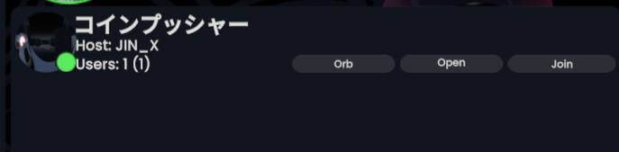

# SessionTweaks

A [NeosModLoader](https://github.com/zkxs/NeosModLoader) mod for [Neos VR](https://neos.com/)  
Add buttons for session orb / copy session uri.

I didn't create an issue because of a limited issue for me, but I did.
https://github.com/Neos-Metaverse/NeosPublic/issues/3468

## Installation
1. Install [NeosModLoader](https://github.com/zkxs/NeosModLoader).
1. Place [SessionTweaks.dll](https://github.com/rassi0429/MessageCopy/releases/latest/download/SessionTweaks.dll) into your `nml_mods` folder. This folder should be at `C:\Program Files (x86)\Steam\steamapps\common\NeosVR\nml_mods` for a default install. You can create it if it's missing, or if you launch the game once with NeosModLoader installed it will create the folder for you.
1. Start the game. If you want to verify that the mod is working you can check your Neos logs.

## ScreenShots

The right one is [MessageCopy](https://github.com/rassi0429/MessageCopy).